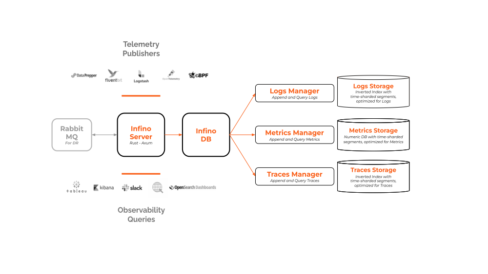

# Store, search, and analyze telemetry data at scale.

[Report Bug](https://github.com/infinohq/infino/issues/new?assignees=&labels=&template=bug_report.md) |
[Request Feature](https://github.com/infinohq/infino/issues/new?assignees=&labels=&template=feature_request.md)

## What is Infino?

Infino is a scalable telemetry store designed for logs, metrics, and traces. Infino can function as a standalone observability solution or as the storage layer in your observability stack.

## Why Infino?
Telemetry data volumes are increasing exponentially yet there is no  purpose-built storage platform for telemetry. Most observability stacks are built on [ElasticSearch](https://github.com/elastic/elasticsearch-rs), [Clickhouse](https://github.com/ClickHouse/ClickHouse) or [Prometheus](https://github.com/prometheus/prometheus), which are powerful tools but are not built for modern telemetry data so the stacks become complex and expensive to manage. Infino's goal is to reduce the **cost** and **complexity** of observability with smart, high-performance storage for customers and vendors alike.

## How it works
To address **cost**, Infino focuses on performance ([**see benchmarks here**](benches/README.md)):

- **Index:** Append-only inverted index (more performant on telemetry data than general-purpose indexes like Lucene).
- **Time:** Efficient sharding and storage based on data recency.
- **Tools:** Rust core using SIMD instruction sets and telemetry-optimized compression.

To address **complexity**, Infino focuses on AI and automation:

- **Access:** NLP support + charts-on-demand for chat interfaces like Slack or Teams.
- **Management:** No schema, no labels, no master node + autoscaled everything.
- **Dashboards:** OSS dashboard support + SQL support for BI interfaces like Tableau or Sigma.
- **Analysis:** Hypeless LLMs + scalable search to accelerate your investigations.

As you look through the code, it might be useful to consider the below architecture diagram.

Telemetry is stored thusly: *Logs* consist of *log messages* stored in compressed *posting blocks*, *Metrics* consist of *metric points* in compressed *time series blocks*, and *Traces* consist of *trace spans* in compressed *posting blocks*.

## Features
Note that we are still very much an alpha product but we have lots on the roadmap. Our development at the moment is focused on increasing the performance of the core engine to address **cost** but we are starting to add features to address **complexity**. 

#### Available now
 - Store logs and metrics
 - Ingest using [FluentBit](https://fluentbit.io/)
 - Query logs and metrics
 - Python client
 - LLM monitoring using [Langchain](https://github.com/langchain-ai/langchain)

#### Coming soon
- Dashboards
- SQL
- NLP
- Traces
- AI copilot

## Getting started

### Try it
For now, you need to build the repo. You will first need to:

- Install [Docker](https://docs.docker.com/engine/install/).
- Install [Rust toolchain](https://www.rust-lang.org/tools/install).

### Examples

* [Integration with Fluentbit](examples/fluentbit/README.md) - Learn how to publish telemetry to Infino using FluentBit.
* [LLM monitoring with Langchain](examples/llm-monitoring-langchain/llm-monitoring-langchain.ipynb) - Discover how Infino's callback in Langchain can be used for monitoring requests in real-time. Also checkout the [Langchain <> Infino docs](https://python.langchain.com/docs/ecosystem/integrations/infino).
* [LLM monitoring with OpenAI](examples/llm-monitoring-openai/llm-monitoring-openai.ipynb) - See an example of monitoring OpenAI's services.
* [Using Infino's Python client](https://pyup.io/packages/pypi/infinopy/) - Get started with the Python client for Infino and explore its functionalities.

 

Please file an issue if you face any problems or [contact us](#telephone_receiver-contact-us) if you
want to discuss your use-case over virtual coffee.

## Contributions

Contributions are welcome and highly appreciated! To get started, check out the [contributing guidelines](CONTRIBUTING.md).

## Contact Us

Ping us on [Slack](https://infinohq.slack.com/join/shared_invite/zt-1tqqc0vsz-jF80cpkGy7aFsALQKggy8g#/shared-invite/email) or send us an email: 
.

## Contributors

A big thank you to the community for making Infino possible!

## License
Infino is distributed under the Elastic 2.0 license.