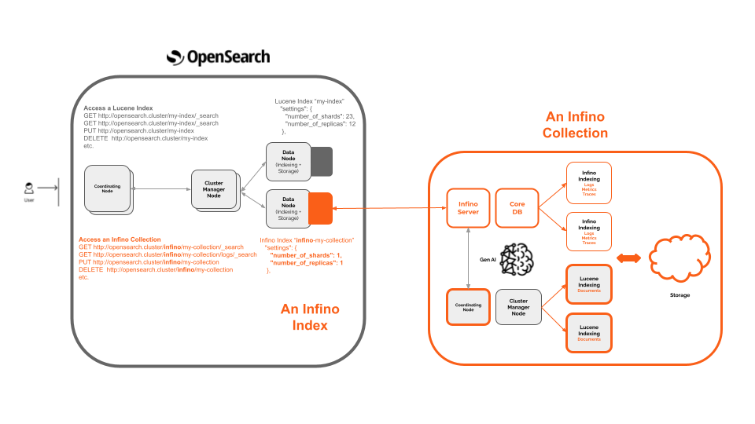

# Store, search, and analyze telemetry data at scale with OpenSearch.

[Report Bug](https://github.com/infinohq/infino/issues/new?assignees=&labels=&template=bug_report.md) |
[Request Feature](https://github.com/infinohq/infino/issues/new?assignees=&labels=&template=feature_request.md)

## What is Infino?

Infino is a next-gen telemetry plugin for OpenSearch designed to handle logs, metrics, and traces at scale. It is designed to turn OpenSearch into a unified, state-of-the-art, AI-led observability stack.

## Why Infino?
Telemetry data volumes are increasing exponentially yet there is no purpose-built search engine for telemetry. Most observability stacks are built on [Lucene](https://lucene.apache.org/), [Clickhouse](https://github.com/ClickHouse/ClickHouse) or [Prometheus](https://github.com/prometheus/prometheus), which are powerful tools but are not built for modern telemetry data so the stacks become complex and expensive to manage. Infino's goal is to rethink observability with smart, high-performance telemetry engine for OpenSearch.

## How it works

Infino defines a set of telemetry data as a **collection**, which is effectively a set of automanaged indexes in OpenSearch.  A collection consists internally of optimized indexes for both documents (Lucene) and telemetry (Infino) that are searchable together. Collections also have built-in AI co-pilots to do summarizations and root cause analysis.

You can access a collection just like you would a normal OpenSearch index, except you don't have to worry about managing clusters or optimizing your index as collections are automatically scaled and optimized. When you access a collection you just need to preface your index with **/infino** as shown in the diagram below. You can read more about accessing OpenSearch [here](https://opensearch.org/docs/latest/).

Infino collections are a great option for security and observability use cases, particularly if users do not want to manage and scale OpenSearch themselves. Infino collections enable a much faster/cheaper/simpler version of OpenSearch for security and observability that accelerate root-cause analysis by combining code, tickets, telemetry, etc. 

It is worth noting that a collection is represented by a mirror Lucene index prefixed with **infino-** which contains stats about the collection and otherwise generally behaves as a normal index in OpenSearch. The caveat is that since collections are autoscaled and automanaged, the number of shards and replicas etc. for an Infino collection will always show as 1 and several index operations like split, merge, replicate, etc. are not honored as they don’t make sense for collections. 

Cluster requests work as normal but do not impact Infino Collections which are automanaged.

## Developer Resources
### [Developing with Visual Studio Code and Dev Containers](docs/DevContainer.md)

### Developer Docs
Read our repo documentation [here](https://infinohq.github.io/infino/doc/infino/index.html).

## Features
Note that we are still very much an alpha product but we have lots on the roadmap. Our development at the moment is focused on increasing the performance of the core engine to address **cost** but we are starting to add features to address **complexity**. 

#### Available now
 - Store logs and metrics
 - OpenSearch plugin
 - Basic boolean Query DSL support
 - Basic OpenSearch dashboard support

#### Coming soon
- DQL support
- More Query DSL coverage
- NLP
- Traces
- AI copilot

## Getting started

### Examples

The core Infino engine has some legacy integrations which might give you a sense of Infino's capabilities. Please note that these integrations are being ported to OpenSearch as Infino is not supported as a standalone engine.

* [Integration with Fluentbit](examples/fluentbit/README.md) - Learn how to publish telemetry to Infino using FluentBit.
* [LLM monitoring with Langchain](examples/llm-monitoring-langchain/llm-monitoring-langchain.ipynb) - Discover how Infino's callback in Langchain can be used for monitoring requests in real-time. Also checkout the [Langchain <> Infino docs](https://python.langchain.com/docs/ecosystem/integrations/infino).
* [LLM monitoring with OpenAI](examples/llm-monitoring-openai/llm-monitoring-openai.ipynb) - See an example of monitoring OpenAI's services.
* [Using Infino's Python client](examples/python-client/rally-tracks.ipynb) - Get started with the [Python client](https://pyup.io/packages/pypi/infinopy/) for Infino and explore its functionalities.

 

Please file an issue if you face any problems or contact us directly if you want to discuss your use-case over virtual coffee.

## Contributions

Contributions are welcome and highly appreciated! To get started, check out our [repo docs](http://infinohq.github.io/infino/doc/infino/index.html) and the [contributing guidelines](CONTRIBUTING.md).

## Contact Us

Ping us on [Slack](https://infinohq.slack.com/join/shared_invite/zt-1tqqc0vsz-jF80cpkGy7aFsALQKggy8g#/shared-invite/email) or send us an email: 
.

## Contributors

A big thank you to the community for making Infino possible!

## License
Infino is distributed under the Elastic 2.0 license.
