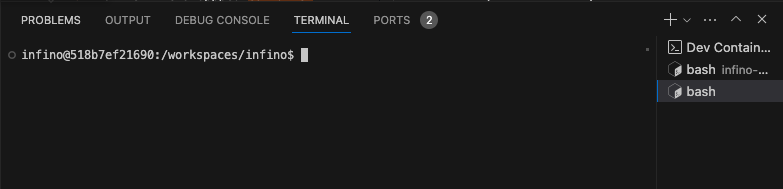

# Store, search, and analyze telemetry data at scale.

[Report Bug](https://github.com/infinohq/infino/issues/new?assignees=&labels=&template=bug_report.md) |
[Request Feature](https://github.com/infinohq/infino/issues/new?assignees=&labels=&template=feature_request.md)

## What is Infino?

Infino is a scalable telemetry search engine designed for logs, metrics, and traces. Infino is integrated with OpenSearch.

## Why Infino?
Telemetry data volumes are increasing exponentially yet there is no  purpose-built storage platform for telemetry. Most observability stacks are built on [ElasticSearch](https://github.com/elastic/elasticsearch-rs), [Clickhouse](https://github.com/ClickHouse/ClickHouse) or [Prometheus](https://github.com/prometheus/prometheus), which are powerful tools but are not built for modern telemetry data so the stacks become complex and expensive to manage. Infino's goal is to reduce the **cost** and **complexity** of observability with smart, high-performance storage for customers and vendors alike.

## How it works
To address **cost**, Infino focuses on performance ([**see benchmarks here**](benches/README.md)):

- **Index:** Append-only inverted index (more performant on telemetry data than general-purpose indexes like Lucene).
- **Time:** Efficient sharding and storage based on data recency.
- **Tools:** Rust core using SIMD instruction sets and telemetry-optimized compression.

To address **complexity**, Infino focuses on AI and automation:

- **Access:** NLP support + charts-on-demand for chat interfaces like Slack or Teams.
- **Management:** No schema, no labels, no master node + autoscaled everything.
- **Dashboards:** OSS dashboard support + SQL support for BI interfaces like Tableau or Sigma.
- **Analysis:** Hypeless LLMs + scalable search to accelerate your investigations.

## Developer Resources
### Developing with Visual Studio Code and Dev Containers
If your IDE is [VS Code](https://code.visualstudio.com), with the [Dev Containers extension](https://marketplace.visualstudio.com/items?itemName=ms-vscode-remote.remote-containers) you can use a container as your full featured development environment to build and test Infino. The container includes all the tools you need to build and test Infino. 

#### To get started, follow these steps:
1. Install the [Dev Containers extension](https://marketplace.visualstudio.com/items?itemName=ms-vscode-remote.remote-containers) extension in VS Code.
2. In VS Code open the **Command Palette** (⌘-⇧-P in Mac, Ctrl-⇧-P in Windows/Linux) and select **Dev Containers: Open Folder in Container...**.
  
3. Select the folder containing the cloned Infino repo.

#### Build, test and run Infino in the container
1. Opening the terminal in VS Code automatically opens the container's shell with the Infino repo mounted in the container. Any changes to the code will be reflected in the container.
  
2. The dev container config exposes port 3000 on the host. You can build and run Infino inside the container (via the terminal) and access Infino's REST API endpoint from the host.

#### Exiting the Dev Container
1. To leave the dev container environment, open the **Command Palette** (⌘-⇧-P in Mac, Ctrl-⇧-P in Windows/Linux) and select **Dev Containers: Reopen Folder Locally**.
  
2. The dev container config exposes port 3000 on the host. You can build and run Infino inside the container (via the terminal) and access Infino's REST API endpoint from the host.
3. This will stop the container and open the Infino repo locally. Use `docker ps -a` to view the stoppped container.

#### Doing more with Dev Containers
To further leverage Dev Containers in your workflow, checkout
- [Developing inside a Container](https://code.visualstudio.com/docs/devcontainers/containers)
- [Development Containers](https://containers.dev)

### Developer Docs
Read our repo documentation [here](https://infinohq.github.io/infino/doc/infino/index.html).

## Features
Note that we are still very much an alpha product but we have lots on the roadmap. Our development at the moment is focused on increasing the performance of the core engine to address **cost** but we are starting to add features to address **complexity**. 

#### Available now
 - Store logs and metrics
 - Ingest using [FluentBit](https://fluentbit.io/)
 - Query logs and metrics
 - Python client
 - LLM monitoring using [Langchain](https://github.com/langchain-ai/langchain)

#### Coming soon
- Dashboards
- SQL
- NLP
- Traces
- AI copilot

## Getting started

### Try it
For now, you need to build the repo. You will first need to:

- Install [Docker](https://docs.docker.com/engine/install/).
- Install [Rust toolchain](https://www.rust-lang.org/tools/install).

### Examples

* [Integration with Fluentbit](examples/fluentbit/README.md) - Learn how to publish telemetry to Infino using FluentBit.
* [LLM monitoring with Langchain](examples/llm-monitoring-langchain/llm-monitoring-langchain.ipynb) - Discover how Infino's callback in Langchain can be used for monitoring requests in real-time. Also checkout the [Langchain <> Infino docs](https://python.langchain.com/docs/ecosystem/integrations/infino).
* [LLM monitoring with OpenAI](examples/llm-monitoring-openai/llm-monitoring-openai.ipynb) - See an example of monitoring OpenAI's services.
* [Using Infino's Python client](examples/python-client/rally-tracks.ipynb) - Get started with the [Python client](https://pyup.io/packages/pypi/infinopy/) for Infino and explore its functionalities.

 

Please file an issue if you face any problems or contact us directly if you want to discuss your use-case over virtual coffee.

## Contributions

Contributions are welcome and highly appreciated! To get started, check out our [repo docs](http://infinohq.github.io/infino/doc/infino/index.html) and the [contributing guidelines](CONTRIBUTING.md).

## Contact Us

Ping us on [Slack](https://infinohq.slack.com/join/shared_invite/zt-1tqqc0vsz-jF80cpkGy7aFsALQKggy8g#/shared-invite/email) or send us an email: 
.

## Contributors

A big thank you to the community for making Infino possible!

## License
Infino is distributed under the Elastic 2.0 license.
