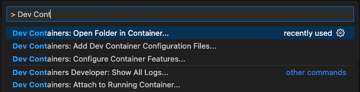

If your IDE is [VS Code](https://code.visualstudio.com), with the [Dev Containers extension](https://marketplace.visualstudio.com/items?itemName=ms-vscode-remote.remote-containers) you can use a container as your full featured development environment to build and test Infino. The container includes all the tools you need to build and test Infino. 

#### To get started, follow these steps:
1. Install the [Dev Containers extension](https://marketplace.visualstudio.com/items?itemName=ms-vscode-remote.remote-containers) extension in VS Code.
2. In VS Code open the **Command Palette** (⌘-⇧-P in Mac, Ctrl-⇧-P in Windows/Linux) and select **Dev Containers: Open Folder in Container...**.
  
3. Select the folder containing the cloned Infino repo.

#### Build, test and run Infino in the container
1. Opening the terminal in VS Code automatically opens the container's shell with the Infino repo mounted in the container. Any changes to the code will be reflected in the container.
  
2. The dev container config exposes port 3000 on the host. You can build and run Infino inside the container (via the terminal) and access Infino's REST API endpoint from the host.

#### Exiting the Dev Container
1. To leave the dev container environment, open the **Command Palette** (⌘-⇧-P in Mac, Ctrl-⇧-P in Windows/Linux) and select **Dev Containers: Reopen Folder Locally**.
  
2. The dev container config exposes port 3000 on the host. You can build and run Infino inside the container (via the terminal) and access Infino's REST API endpoint from the host.
3. This will stop the container and open the Infino repo locally. Use `docker ps -a` to view the stoppped container and delete it if necessary.

#### Doing more with Dev Containers
To further leverage Dev Containers in your workflow, checkout
- [Developing inside a Container](https://code.visualstudio.com/docs/devcontainers/containers)
- [Development Containers](https://containers.dev)