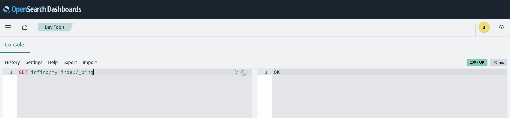

# Infino quickstart with docker compose
The [docker-compose.yml](../docker/docker-compose.yml) in the repo deploys Infino server, OpenSearch with Infino plugin and OpenSearch dashboard.

## Pre-requisites
- Install [docker](https://docs.docker.com/get-docker/) and [docker compose](https://docs.docker.com/compose/). A typical installation of [docker desktop](https://docs.docker.com/desktop/) includes docker compose. 

## Deploy the setup
```bash
docker-compose -f docker/docker-compose.yml down
```
It may take a minute or two for all the containers to come up.

## Accessing OpenSearch Dashboard
- Point your browser to `http://localhost:5601`
- Login using the default OpenSearch dashboard username:password → admin:admin

## Accessing Infino from the the OpenSearch Dashboard
- In the OpenSearch Dashboard, navigate to the Dev Tools Console.
- Access Infino from the Console using REST calls. Inifno REST calls are prefixed with `infino/`. For example: `GET infino/my-index/_ping`.

  

**Note:** The plugin is under development and currently supports a limited subset of the Infino capabilities.

## Accessing Infino from the OpenSearch API layer
- The OpenSearch REST APIs are available at `https://localhost:9200/`. Infino can be accessed at this end point via the plugin.

```bash
curl https://localhost:9200/infino/my-index/_ping -ku admin:admin
```

## Accessing Infino directly via API
- The Infino server is available at `http://localhost:3000/`.

```bash
curl http://localhost:3000/ping
```