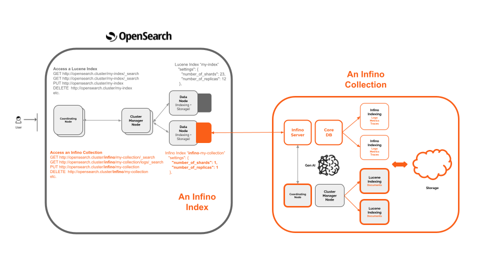

# Infino OpenSearch Plugin

## What is the Infino plugin for OpenSearch?

The Infino OpenSearch plugin allows Infino to handle requests to operation on a collection. It is a REST handler plugin that allows requests to bypass Lucene and be handled by the Infino telemetry engine.



## Developer Docs
Read the OpenSearch documentation [here](https://opensearch.org/docs/latest/api-reference/search/). We do not support all API calls; we will be building a documented list of what we support. More to come.

## Features
Note that we are still very much an alpha product but we have lots on the roadmap. Our development at the moment is focused on increasing the performance of the core engine to address **cost** but we are starting to add features to address **complexity**. We hope to transform OpenSearch into a best-in-class observability stack.

#### Available now
 - We are currently focused on improving logs / metrics performance in OpenSearch by 10x.

#### Coming soon
- NLP
- Traces
- LLM monitoring using [Langchain](https://github.com/langchain-ai/langchain)
- AI copilot

## Getting started

### Try it
For now, you need to build the repo. You will first need to:

- Install [Docker](https://docs.docker.com/engine/install/).
- Install [SDKMan](hhttps://sdkman.io/).
- Clone [Infino](https://github.com/infinohq/infino).
- Clone [OpenSearch](https://github.com/opensearch-project/OpenSearch).
- Clone [OpenSearch dashboard](https://github.com/opensearch-project/OpenSearch-Dashboards).
- Gradle build


### Instructions
#### Set [SDKMan to use Java 17](https://sdkman.io/usage)
#### Add the following to your Java policy
`$HOME/.sdkman/candidates/java/current/conf/security/java.policy`
```
grant {
  // Add permissions to allow Infino OpenSearch Plugin to access Infino using OpenSearch threadpool
permission org.opensearch.secure_sm.ThreadPermission "modifyArbitraryThread";
permission java.net.URLPermission "http://localhost:3000/-", "*";
}
```
#### Build the plugin
1. Go the infino-search-plugin root directory
2. Type ``./gradlew build``
#### Install the plugin in OpenSearch and launch
1. Go to the OpenSearch root directory
2. Remove any old infino plugins `bin/opensearch-plugin remove infino-opensearch-plugin-3.0.0-SNAPSHOT`
2. Install the plugin bin/opensearch-plugin -v install `file:///path/to/infino-opensearch-plugin/build/distributions/infino-opensearch-plugin-3.0.0-SNAPSHOT.zip` (note that you should replace 3.0.0-SNAPSHOT with your opensearch version number)
3. Run OpenSearch `bin/opensearch` - this will start OpenSearch on port 9200.

#### Build Infino and launch
1. Go to the Infino root dir.
2. Type `make run` - this will start Infino on port 3000.

#### Test the chain is working
1. In any shell window, type `curl http://localhost:9200/infino/my-index/_ping`. You should receive a response 'OK'.
#### Start OpenSearch Dashboard
1. Go to the OpenSearch Dashboard root dir
2. Type `npm install 18`
3. Type `yarn osd clean`
4. Type `yarn osd bootstrap`
5. Type `yarn start`
6. From stdout you will see a line like this: `server log   [03:45:12.165] [info][server][OpenSearchDashboards][http] http server running at http://localhost:5603/qtf`. Point your brower to the URL.


Please file an issue if you face any problems or contact us directly if you want to discuss your use-case over virtual coffee.

## How to access your Infino collection
All indexes in Infino have a mirror Lucene index prefixed with `infino-`. Accessing infino-my-index, for example, will give you stats about your Infino Collection. However, to act on your Infino collection (post a doc or search etc) you will access the collection as `/infino/my-index`.


## Contributions

Contributions are welcome and highly appreciated! To get started, check out our [repo docs](http://infinohq.github.io/infino/doc/infino/index.html) and the [contributing guidelines](CONTRIBUTING.md).

## Contact Us

Ping us on [Slack](https://infinohq.slack.com/join/shared_invite/zt-1tqqc0vsz-jF80cpkGy7aFsALQKggy8g#/shared-invite/email) or send us an email: 
.

## Contributors

A big thank you to the community for making Infino possible!

<a href="https://github.com/infinohq/infino/graphs/contributors">
  
</a>

## License
Infino OpenSearch plugin is distributed under the Apache 2.0 license.


